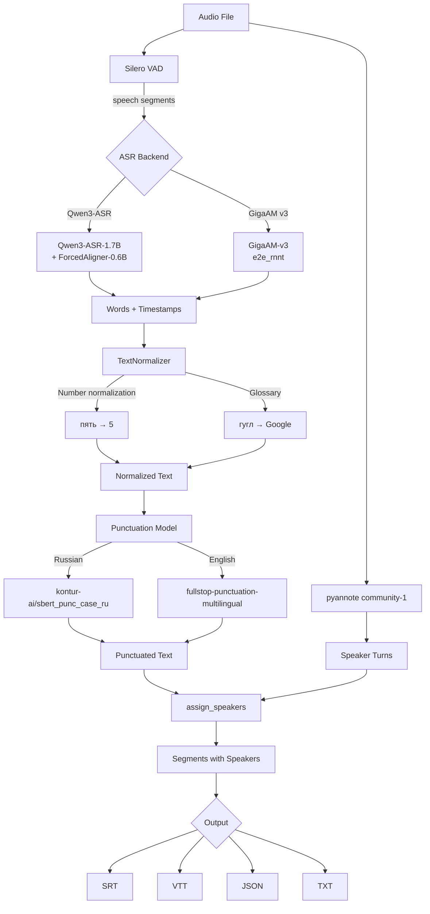
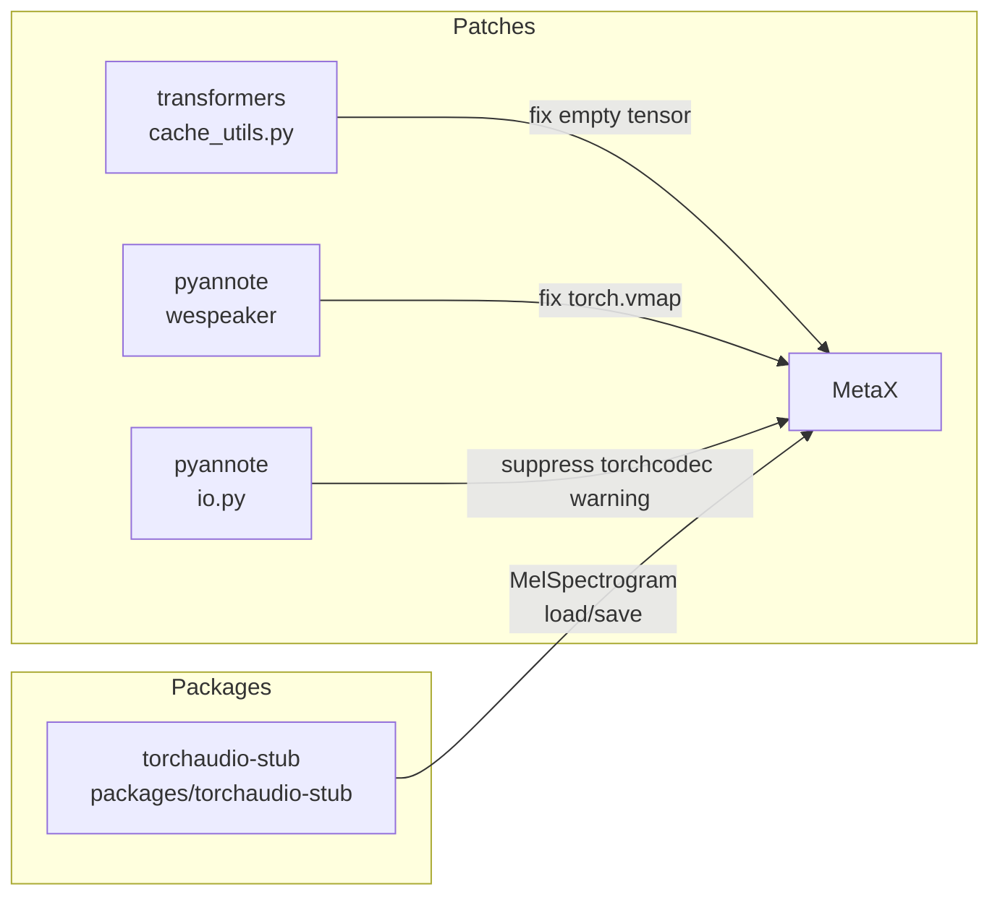

# Architecture

## Data Flow

## Backends

| Backend | Model | Params | WER (Podlodka) | WER (Golos) | Punctuation | Timestamps |
|---------|-------|--------|----------------|-------------|-------------|------------|
| **Qwen3-ASR** | Qwen/Qwen3-ASR-1.7B | 1.7B | 12.40% | 16.14% | External model | Forced aligner |
| **GigaAM v3 (native)** | gigaam (e2e_rnnt) | 240M | 7.74% | 13.15% | Built-in | RNNT decoding |
| **GigaAM v3 (HF)** | ai-sage/GigaAM-v3 (e2e_rnnt) | 240M | 8.09% | 13.15% | Built-in | Approximate |

GigaAM uses native `gigaam` package (with `--no-deps` install + `strict=False` patch) for best quality. Falls back to HuggingFace transformers with a patched `load_audio` (soundfile instead of ffmpeg) when native is unavailable.

## Modules

### `asr.py`
ASR backends with a common `ASRBackend` interface:
- **`Qwen3Backend`**: Wraps `Qwen3ASRModel`. Word timestamps via `Qwen3-ForcedAligner-0.6B`. Supports hotword context for term correction.
- **`GigaAMBackend`**: Russian RNNT model. Tries native `gigaam` package first (best quality), falls back to HF transformers. Handles long audio via VAD-aware chunking with overlap and context carry-over.

### `vad.py`
Voice Activity Detection using Silero VAD v5. Splits audio at natural pause boundaries. Configurable `min_silence_ms` and `max_segment_sec`.

### `bench.py`
WER benchmarking against HuggingFace datasets. Reads parquet directly via pyarrow (bypasses torchcodec). Strips punctuation for fair comparison.

### `punctuate.py`
Restores punctuation and capitalization. Language-specific models:
- Russian: `kontur-ai/sbert_punc_case_ru` (sbert_large_nlu_ru, no tokenizer bugs)
- English: `oliverguhr/fullstop-punctuation-multilingual-base`

### `diarize.py`
Wraps `pyannote.audio.Pipeline`. Loads audio via soundfile (avoids torchcodec). Returns speaker turns with timestamps.

### `merge.py`
Interval-overlap speaker assignment (ported from whisperX). For each word, finds the diarization turn with maximum temporal overlap. Groups consecutive same-speaker words into Segments.

### `correct.py`
Experimental LLM post-processing (Qwen3-0.6B). Fixes ASR errors but slow on CPU. Disabled by default (`--correct` flag).

### `normalize.py`
Post-processing rules that reduce WER by 0.5-2pp:
- Number normalization: converts Russian number words to digits (пять → 5, двадцать пять → 25)
- Ordinal normalization: пятый → 5
- Glossary replacement: custom term corrections via `--glossary` flag

Default: enabled, lightweight, no model required.

### `bench.py`
Output format writers (SRT, VTT, JSON, TXT). Each takes a `TranscriptionResult`.

### `cli.py`
Typer-based CLI with three commands:
- `transcribe`: Full pipeline (VAD → ASR → punctuation → diarize → merge → output)
- `bench`: WER benchmarking
- `info`: Environment diagnostics

### `schemas.py`
Pydantic models: `Word`, `Segment`, `TranscriptionResult`.

### `config.py`
Settings from environment variables with `QWEN_` prefix.

## MetaX GPU Support

### `apply_patches.sh`
Applies MetaX-specific patches:
1. `transformers` cache_utils.py — fixes empty tensor initialization
2. `pyannote` wespeaker — fixes torch.vmap storage issue
3. `pyannote` io.py — suppresses torchcodec warning

### `packages/torchaudio-stub`
Minimal torchaudio replacement for MetaX:
- `load`/`save` via soundfile (no ffmpeg)
- `MelSpectrogram` transform (required by GigaAM)
- Stub implementations for other transforms

## Key Design Decisions

1. **Dual ASR backends**: GigaAM for Russian (fast, accurate), Qwen3 for multilingual.
2. **RNNT over CTC**: GigaAM e2e_rnnt is 5x better than CTC on complex Russian (2.6% vs 13.2% WER).
3. **VAD-aware chunking**: Chunks at natural pause boundaries with overlap and context carry-over, avoiding fixed-length splitting that loses context (~6pp WER improvement).
4. **No vLLM**: Broken on MetaX for long audio. Transformers backend is reliable.
5. **pyannote community-1 only**: Version 3.1 gives garbage output on MetaX.
6. **soundfile everywhere**: Avoids torchcodec/ffmpeg dependency issues on MetaX.
7. **Number normalization + glossary**: Lightweight post-processing that reduces WER by 0.5-2pp without additional models.
8. **Model caching**: Avoids reloading 1.7B+ models on repeated CLI calls.
9. **Future: VibeVoice-ASR**: 9B params, 60-min single-pass, joint ASR+diarization. Currently too heavy for CPU, but a candidate when GPU resources expand.
10. **Future: distillation**: Use GigaAM RNNT as teacher to distill smaller/faster student models for edge deployment.
